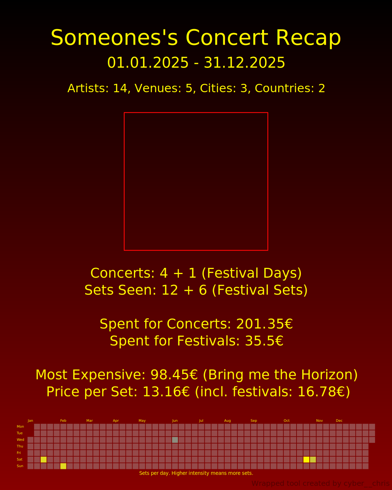
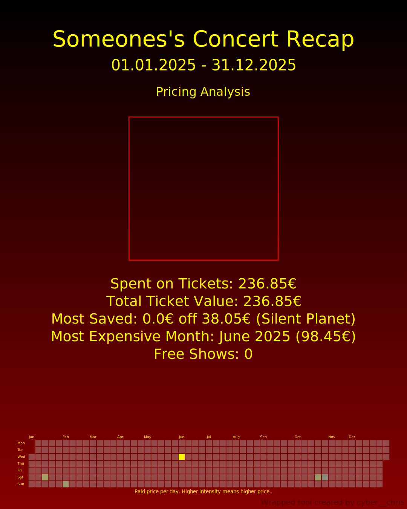
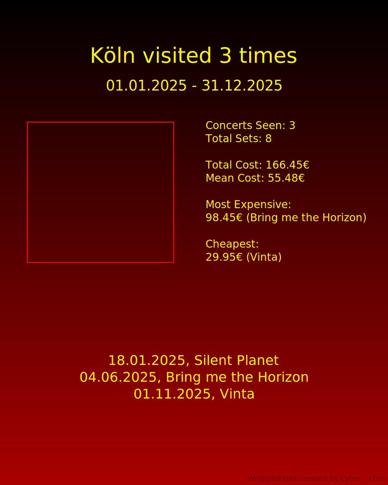

# Concert Wrapped

Think of it as "Wrapped but for concerts" - providing statistics over your concert-going habits, favorite artists, venues, and cities.
All you need is CSV with your data and Concert Wrapped will provide you with the stats as editable SVGs.

Concert Wrapped is built as a FastAPI-based web service that analyzes concert attendance data from CSV files and generates SVG visualizations.

You can also run the analysis from the CLI, if you really want to.


## Examples

<table>
<tr>
<td>

</td>
<td>

</td>
<td>

</td>
<td>

</td>
<td>

</td>
</tr>
</table>

The red frames are placeholders, where you have to insert fitting pictures in post.
I really didn't wanna do anything with image databases and stuff.

## More Detail

The API accepts concert data in CSV format and generates comprehensive visualizations including:

- **User-level statistics**: Total shows attended, ticket costs, calendar heatmaps, and more
- **Artist analysis**: Top artists seen, venues and cities where you saw them, pricing information
- **Venue analysis**: Most visited venues with location and pricing data
- **City analysis**: Concert activity across different cities

All visualizations are generated as SVG files that can be viewed in browsers, downloaded individually, or exported as a ZIP archive.

The SVG approach allows easy modifications to the images by the end user, since everything is editable.

### Please Note
I built this because I wanted to have a tool I write [once](https://xkcd.com/1319/), instead of doing these statistics by hand every time in want some stats.
I also hoped to I might create a tool that is useful (and usable) for my friends too.
It's actually the third time I attempted this. I think I succeeded this time.

Every past attempt I got lost in the 'feature-creep', trying to build the code as clean and modular as possible.
So this I tried to embrace some shortcuts and prefer outcome over perfect engineering.
The code is probably okay to maintain, but there are some functions lacking doc strings or some inconsistent naming/ design in my dataclasses.

## SVG Template Approach

The application uses a **placeholder-driven SVG template system** for generating visualizations.
Instead of programmatically drawing every element, the system, it uses pre-designed SVG templates with placeholder markers (e.g., `<Tcx>` for total cost).


This approach provides:
- **Consistent design**: Templates ensure visual consistency across all generated graphics
- **Easy customization**: Modify SVG templates without changing Python code
- **Scalable output**: SVG format is resolution-independent and web-friendly
- **Fast generation**: Template replacement is more efficient than programmatic drawing
- **Editable after generation**: Everything can be changed after the image is generated and downloaded.

## Environment Variables

| Variable              | Description                                                                   | Default              | Required |
|-----------------------|-------------------------------------------------------------------------------|----------------------|----------|
| `PORT`                | Port to listen on                                                             | 13675     | No |
| `ARTIFACTS_PATH`      | Directory path where generated SVG files are stored                           | `"out"`              | No |
| `LOG_DIR`             | Directory path for log files                                                  | `None` (console only) | No |
| `GC_MAX_AGE_HOURS`    | Maximum age in hours before artifact folders are deleted by garbage collector | `24`                 | No |
| `GC_INTERVAL_MINUTES` | Interval in minutes between garbage collector cleanup runs                    | `10`                 | No |

## Running the thing

### Prerequisites

- Python 3.10 or higher
- pip

### Setup

1. **Clone the repository** (if not already done):
   ```bash
   git clone <repository-url>
   cd concert_data_thing
   ```

2. **Create a virtual environment** (recommended):
   ```bash
   python -m venv venv
   source venv/bin/activate  # On Windows: venv\Scripts\activate
   ```

3. **Install dependencies**:
   ```bash
   pip install -r requirements.txt
   pip install -e .
   ```

4. **Set environment variables** (optional):
   ```bash
   export BASIC_AUTH_USERNAME="your_username"
   export BASIC_AUTH_PASSWORD="your_password"
   export ARTIFACTS_PATH="out"
   export GC_MAX_AGE_HOURS="24"
   export GC_INTERVAL_MINUTES="10"
   ```

5. **Run the API server**:
   ```bash
   start-concert-api
   ```

   Or directly with Python:
   ```bash
   python -m concert_data_thing.endpoints
   ```

   Or using uvicorn directly:
   ```bash
   uvicorn concert_data_thing.endpoints:app --host 0.0.0.0 --port 13675 --reload
   ```

6. **Access the API**:
   - Web interface: http://localhost:13675/
   - API documentation: http://localhost:13675/docs
   - Health check: http://localhost:13675/health
   - Download sample data: http://localhost:13675/api/v1/example-chris

The API will be available at `http://localhost:13675`.
Generated SVG files will be stored in the `out/` directory (or the path specified by `ARTIFACTS_PATH`).

#### AI Disclosure
I used AI to accelerate parts of the development process.
Everything in this Repo was audited by myself, I only accept (AI) changes manually.

Most of the backend is written completely by hand.
The frontend on the other hand has a rather large AI-ratio.
The initial version of this readme was also done by AI.

There is no usage of AI beside generating code, the designs of the SVGs are done by humans only.
